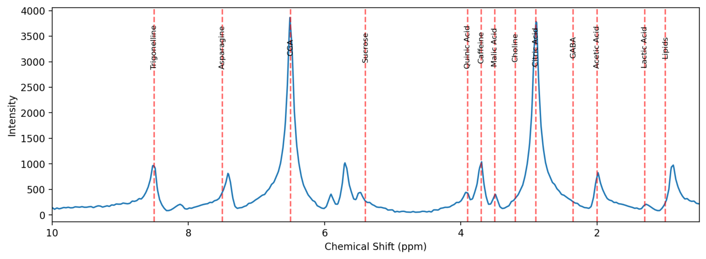
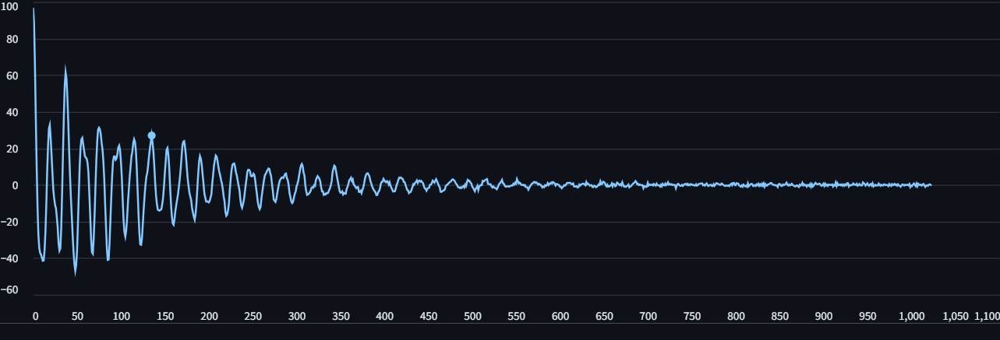
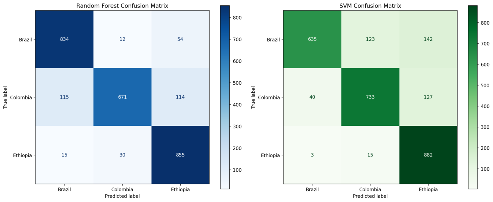
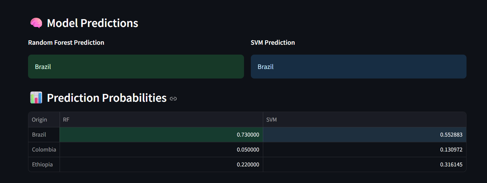

# NMR-Based Classification of Coffee Origin Using Metabolite Profiling

This project demonstrates how Nuclear Magnetic Resonance (NMR) spectroscopy and machine learning can be combined to classify the geographic origin of coffee samples. The workflow is implemented in an interactive Streamlit web app that simulates NMR spectra from known metabolite data and predicts coffee origin using trained classifiers.

---

## Features

- **NMR Signal Simulation:** Generates synthetic Free Induction Decay (FID) signals for coffee samples based on literature-reported metabolite chemical shifts and intensities for different regions (Ethiopia, Colombia, Brazil).
- **Spectrum Generation:** Converts FID signals to frequency-domain NMR spectra using Fast Fourier Transform (FFT), visualizing characteristic metabolite peaks.
- **Spectrometer Tuning:** Interactive module for simulating spectrometer tuning, including Larmor frequency and tuning capacitance adjustments.
- **Machine Learning Classification:** Uses metabolite intensities as features for SVM and Random Forest models to predict coffee origin.
- **Streamlit Web App:** User-friendly interface to select coffee region, visualize spectra, tune spectrometer, and view classification results in real time.

---

## Project Structure

- `app.py` – Main Streamlit application
- `analysis.py` – Data analysis utilities
- `compounds.py` – Metabolite data and chemical shift definitions
- `config.py` – Configuration parameters
- `dataset.py` – Dataset handling and preprocessing
- `ml.py` – Machine learning models and evaluation
- `simulation.py` – NMR signal and spectrum simulation functions
- `visualization.py` – Plotting and visualization utilities
- `nmr_coffee_dataset.csv` – Simulated dataset of metabolite intensities
- `rf_coffee_classifier.pkl`, `svm_coffee_classifier.pkl`, `svm_scaler.pkl` – Pretrained model and scaler files
- `images/` – Project images and screenshots

---

## Methodology

1. **Data Collection:** Gather chemical shift and intensity data for key coffee metabolites from published studies for each region.
2. **Signal Simulation:** Model each metabolite as a decaying sinusoid and sum to produce the FID signal.
3. **Spectrum Generation:** Apply FFT to the FID to generate the NMR spectrum, mapping peaks to metabolites.
4. **Spectrometer Tuning:** Simulate adjustments to magnetic field and tuning capacitance for resonance matching.
5. **Classification:** Extract metabolite intensities and use them as features for supervised learning models (SVM, Random Forest) to predict coffee origin.

---

## Usage

1. **Install dependencies** (see `requirements.txt`).
2. **Run the app:**
   `streamlit run app.py`
3. **Explore the app:**

- Select a coffee origin and visualize its simulated NMR spectrum.
- Adjust spectrometer parameters.
- View machine learning classification results.

---

## Visuals

Below are sample outputs from the simulation and the Streamlit app:

| NMR Spectra                            | FID Signal                           |
| -------------------------------------- | ------------------------------------ |
|  |  |

| Confusion Matrix                                 | Predictions (Streamlit Screenshot)                |
| ------------------------------------------------ | ------------------------------------------------- |
|  |  |

---

## Results

- The simulation distinguishes coffee samples from Ethiopia, Colombia, and Brazil using NMR-based metabolite profiles.
- The interactive app demonstrates the workflow of NMR-based food authentication and machine learning.

---

## Future Work

- Add more coffee-producing regions and diverse metabolite data.
- Integrate real-world NMR datasets for model validation.
- Expand for broader food traceability and authenticity applications.

---

_This project is an educational prototype illustrating the workflow of NMR-based origin classification and is not a substitute for real-world analytical validation._
